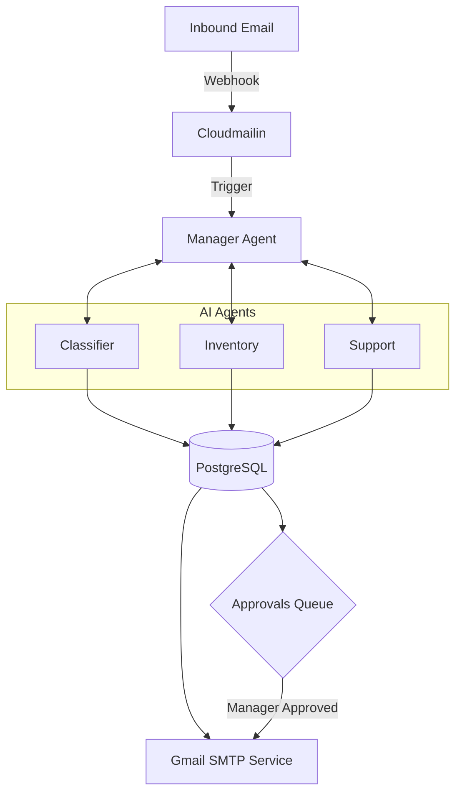

# OpsPilot AI — Autonomous Enterprise Operations Hub

OpsPilot AI is a premium, real-time agentic orchestration platform designed to automate day-to-day back-office tasks, customer support workflows, and warehouse fulfillment operations. Powered by a collaborative team of specialized AI agents running on ultra-fast LPUs, OpsPilot matches incoming customer requests to live operations databases, manages order pipelines, raises replenishment orders, and processes manager approvals seamlessly.

---

## 🌌 Core Architecture & Workflow

OpsPilot coordinates multiple specialized AI subagents through a central Manager Orchestrator. Below is the communication flow of a customer inquiry:

---

## ⚡ Premium Platform Features

### 📬 Real-Time Production Inbox
- **Direct Mail integration**: Fully connected to incoming emails via Cloudmailin and sent using Gmail SMTP.
- **Inbound Message Viewer**: Displays customer details, parsed subjects, and inbound bodies.
- **Agent Action Timelines**: Shows the step-by-step logs of every subagent involved in routing, searching, or drafting replies.
- **Interactive Drafting**: Displays suggestion histories and provides a manual response editor to dispatch custom replies directly.

### 🛒 Sales Order Lifecycle
- **Dynamic Order Tracking**: Lists all active sales orders, search filters, and status counters.
- **Automatic Stock Replenishment**: Transitioning orders to `CANCELLED` or `REFUNDED` automatically releases allocated stocks back into warehouse inventories. Transitioning back to active status re-allocates stock.
- **Dynamic Customer Notifications**: Every order status transition (`PROCESSING`, `SHIPPED`, `DELIVERED`, `CANCELLED`, `REFUNDED`) automatically emails a branded invoice update to the customer in **Indian Rupees (₹)**.

### 📦 Wholesale Procurement & Supplier Profiles
- **Supplier Registry**: Manage company profiles, contact personnel, emails, and phone numbers for wholesale suppliers.
- **Replenishment POs**: Automatically or manually draft wholesale Purchase Orders (POs) to refill low stock levels.
- **Replenishment Triggers**: Transitioning a PO status to `DELIVERED` or `RECEIVED` automatically increments the stock levels of the products in the database.

### 🛡️ Approval Center
- **Wholesale Threshold Checks**: PO drafts exceeding **₹80,000** require manual manager approvals.
- **Customer Refund Safeguards**: Refund requests classified from customer emails automatically create a pending approval request.
- **Status Sync**: Approving or rejecting updates the respective sales orders, updates inventories, and dispatches confirmation notifications.

### ⚙️ Indian Rupees (₹ / INR) Currency Switch
- The entire platform metrics (Daily Sales, approvals, PO amounts, catalog retail/wholesale prices) and React-rendered email templates format currency using Indian standard layouts (`₹1,24,500.00`).

---

## 🛠️ The Technical Stack

- **Frontend Core**: Next.js (App Router) with React Server & Client Components
- **Inference Engine**: Groq LPU (Language Processing Unit) running Llama-3 models
- **Database**: Neon Serverless PostgreSQL
- **Database Interface**: Prisma ORM
- **Authentication**: Clerk User Auth
- **Data Synchronization**: TanStack Query (React Query) with active 3-second polling
- **Delivery Service**: Nodemailer SMTP with customized email templates
- **Email Listener**: Cloudmailin HTTP Webhooks
- **UI Icons**: Lucide React
